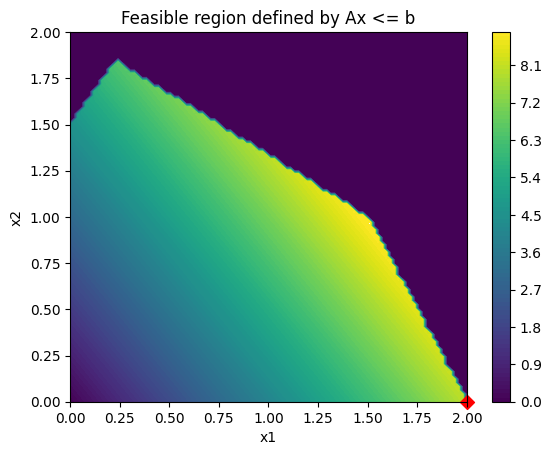

# Numpy Simplex Implementation

## Directory

`simplex.py` -- Algorithm implementation

`plot.py` -- Plotting functions

`test.py` -- Test cases

## Example Usage

```{Python}
c = np.array([4, 3])
A = np.array([
    [2, 3],
    [-3, 2],
    [0, 2],
    [2, 1]
])
b = np.array([6, 3, 5, 4])
plot.animate(c, A, b, size = 2, reset_frames = True, verbose = True)
```

Generates the following output:

Iteration 0 (Initialized):
```
Maximum Objective: 8.96969696969697
Initial Tableau: 
[[ 1. -4. -3.  0.  0.  0.  0.  0.]
 [ 0.  2.  3.  1.  0.  0.  0.  6.]
 [ 0. -3.  2.  0.  1.  0.  0.  3.]
 [ 0.  0.  2.  0.  0.  1.  0.  5.]
 [ 0.  2.  1.  0.  0.  0.  1.  4.]]
Current Objective: 0.0
```
Visualized by:


Iteration 1:
```
Maximum Objective: 8.96969696969697
Tableau 0: 
[[ 1.   0.  -1.   0.   0.   0.   2.   8. ]
 [ 0.   0.   2.   1.   0.   0.  -1.   2. ]
 [ 0.   0.   3.5  0.   1.   0.   1.5  9. ]
 [ 0.   0.   2.   0.   0.   1.   0.   5. ]
 [ 0.   1.   0.5  0.   0.   0.   0.5  2. ]]
Current Objective: 8.0
```
Visualized by:



Iteration 2:
```
Maximum Objective: 8.96969696969697
Tableau 1: 
[[ 1.    0.    0.    0.5   0.    0.    1.5   9.  ]
 [ 0.    0.    1.    0.5   0.    0.   -0.5   1.  ]
 [ 0.    0.    0.   -1.75  1.    0.    3.25  5.5 ]
 [ 0.    0.    0.   -1.    0.    1.    1.    3.  ]
 [ 0.    1.    0.   -0.25  0.    0.    0.75  1.5 ]]
Current Objective: 9.0
```
Visualized by:


